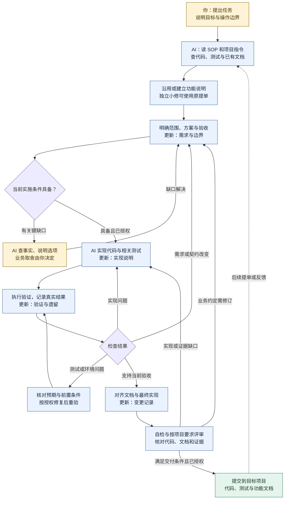

# Workflow-SOP

把仓库交给 AI，提出任务，由 AI 按下面的流程推进；功能文档随工作更新，方便后来的人接着修改。

## 整个流程

下面以一次功能开发或修改为主线。四处“更新”指向同一份功能说明，不是四份文件。



资料、权限或环境暂时不足时，记录阻断与下一步，只暂停依赖该条件的工作；反复失败没有新证据时调整诊断路线。图中的回流不表示一直重试或每阶段都要审批。任务提交、验收和发布分别按项目约定处理，提交不等于已发布。详细条件见 [工作指南](docs/WORKFLOW.md)。

## 完成后提交什么

**普通功能默认交付一个文档文件：`功能名.md`，例如 `收藏功能.md`；已有对应文档就更新它。** 代码及相关测试的改动随同提交。现有项目使用其他文档格式时沿用，不重复建一份。

文件名示例不是要求新增固定目录。`templates/SPEC.md` 是本仓库的模板，实际交付时用具体功能命名，放在目标项目已有文档位置。

| 这次做的工作 | 需要提交的文档 |
|---|---|
| 新功能 | 新增 `收藏功能.md` 这样的功能说明；已有合适文档时直接补充 |
| 扩展或修改已有功能 | 更新原功能说明，不另建“第二版”文档 |
| 独立小修复 | 原提单或 PR 中写改动和验证即可；影响已记录的功能行为或设计时同步原文档 |

最终文件沿用 [功能说明模板](templates/SPEC.md) 的四部分：

```markdown
# 收藏功能
## 需求与边界
## 实现说明
## 验证与遗留
## 变更记录
```

四节分别写清：当前规则与验收；实际关键逻辑、代码入口和理由；实际验证证据及未完成项；本次提单、改动原因及提交入口。以上只是文件结构，不能把空标题或模板提示当作已完成文档。

代码和文档随本次工作提交到**目标项目**，按已有目录和提交方式保存；提单或 PR 链接文档与验证证据。无需另外提交一套 PRD、设计文档、测试报告和交付报告。项目已有明确交付要求时沿用。示例见 [同一文档的两次修改](examples/L2-standard-feature.md)。

## 从这里开始

在能访问目标项目的 AI 会话中发送：

```text
请读取 https://github.com/YIMO691/Workflow-SOP 的 README 和 docs/WORKFLOW.md，按指南完成任务。
先检查目标项目与已有记录，在实现、验证过程中更新对应功能说明。
最后交付改动、文档位置、实际验证结果和未完成项。
任务：<描述要解决的问题，或提供已有提单>
```

有特殊操作边界时一并说明。私有仓库或项目读不到时，由 AI 说明缺口，取得获准读取的内容后继续；首次使用无须安装技能或部署服务。

## 给 AI 的执行入口

先读 [工作指南](docs/WORKFLOW.md)，核对目标项目指令与已有记录。新功能缺少合适记录时采用 [功能说明模板](templates/SPEC.md)；需要时查 [工程规则](docs/ENGINEERING_RULES.md)、[技能推荐](skills/README.md) 或 [工具接入](docs/AI_COLLABORATION.md)。此仓库的 `AGENTS.md` 仅用于维护本仓库。

[获取帮助](SUPPORT.md) · [文档用法](templates/README.md) · [贡献与检查](CONTRIBUTING.md) · [变更记录](CHANGELOG.md) · [来源与历史](docs/SOURCES.md) · [安全说明](SECURITY.md)

团队试行参考，未验证普遍效率收益。私有协作仓库，未选择开源许可证，资料使用遵循原授权。
