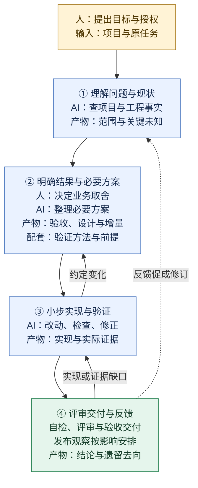
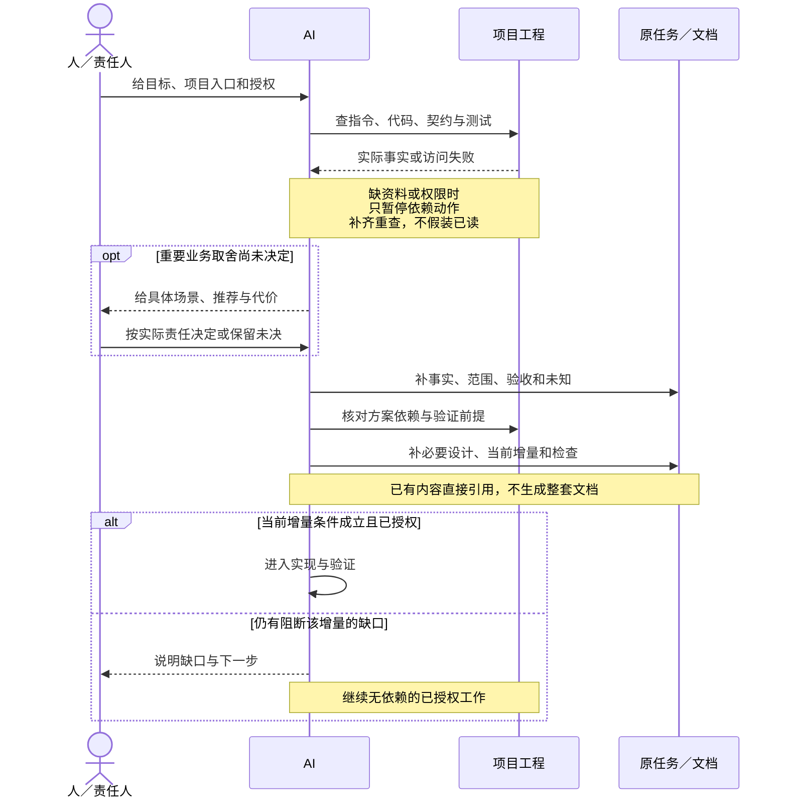
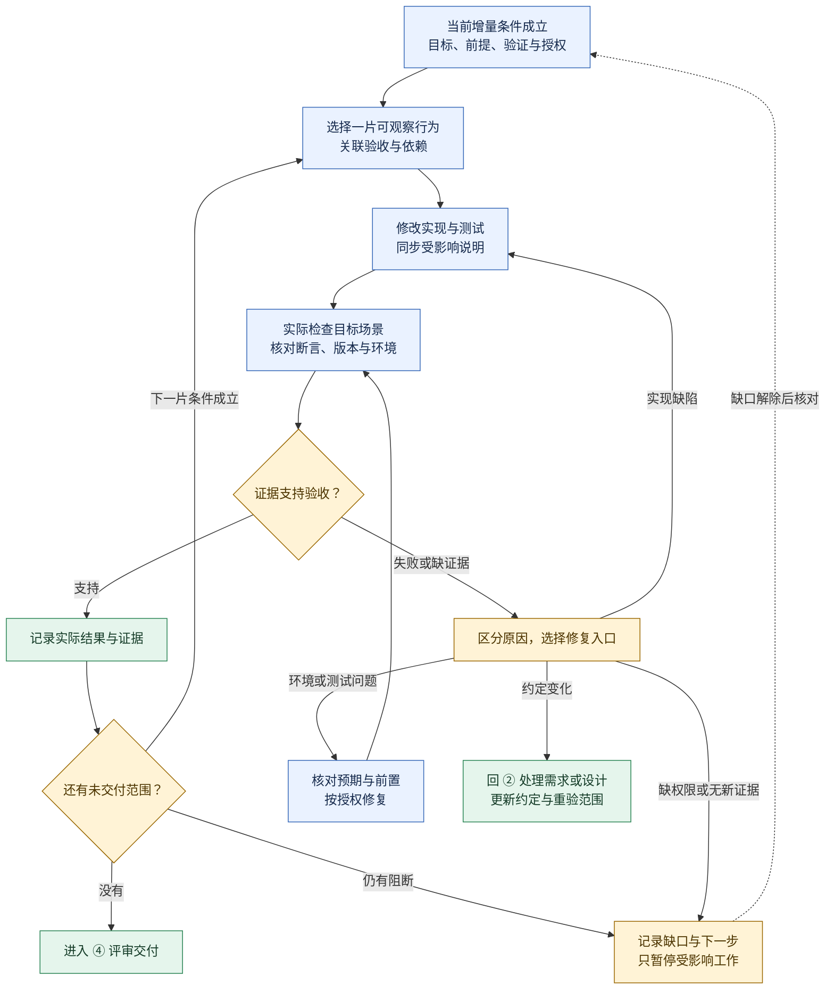
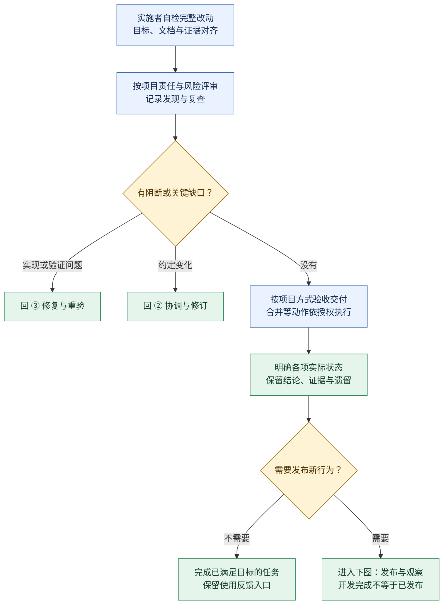
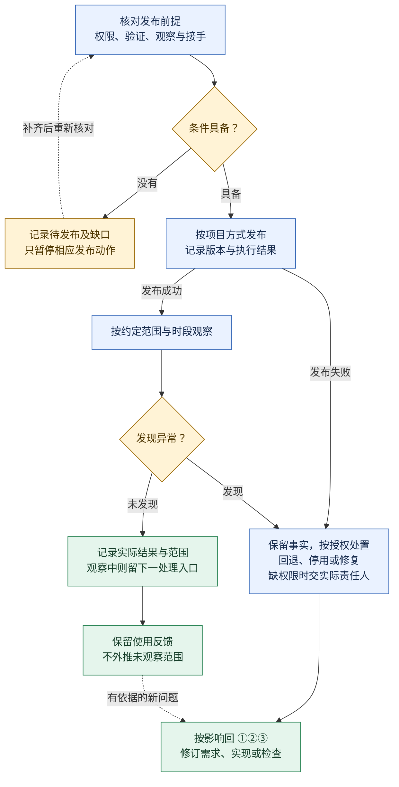
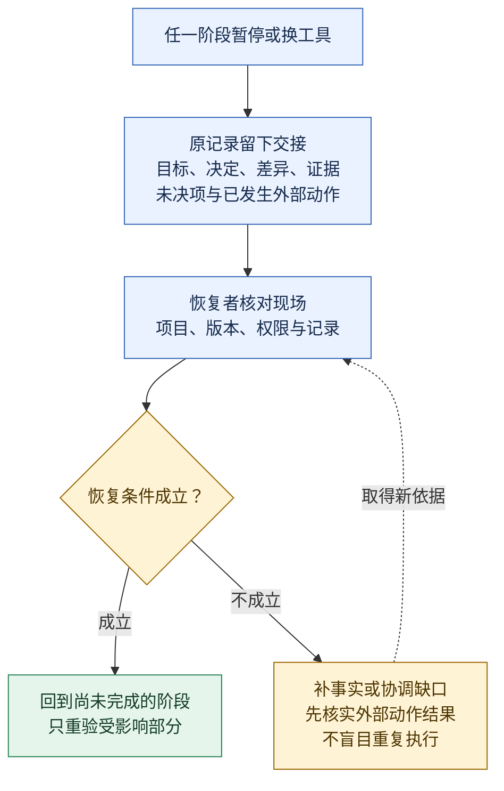

# Workflow-SOP · 日常研发协作

一套供开发者、需求方、测试与评审者共同使用的 AI 辅助研发流程：从理解问题，到小步实现、验证交付，再把实际反馈用于改进。

**状态：团队试行参考。** 文档整理不代表公司制度已生效，也未证明实际效率收益。变更的纳入状态以对应 PR 为准，采用时固定已评审的版本，项目已有权限、技术与发布要求继续有效。

[全链路图](#完整链路) · [快速开始](#从这里开始) · [完整流程](docs/WORKFLOW.md) · [AI 接入](docs/AI_COLLABORATION.md#首次接入) · [记录模板](templates/README.md) · [获取帮助](SUPPORT.md)

## 完整链路

**先看主线，再展开需要的环节。** 每个阶段同时写明动作和留下的结果；带条件的回流箭头表示发现问题后回到哪里，不表示每次都重走流程。



人参与业务取舍、授权与必要验收；AI 在已授权范围内连续推进，不要求逐框批准。Codex、Claude Code 等原生工具执行搜索、编辑和命令；项目约定、可用工具与真实反馈支撑整个过程，无须额外搭建运行框架。详细判断仍以 [流程正文](docs/WORKFLOW.md) 为准。

<details>
<summary><strong>展开 ①②：输入怎样变成可实施的约定？看人与 AI 的分工</strong></summary>



**本段产物**：原任务或功能说明中的验收、必要设计、增量和检查方式。需要独立维护才拆 [需求说明、技术方案或验证计划](templates/README.md#各文档解决什么问题)。记录的是已知与待定，不是一次自动批准。

[实施条件](docs/WORKFLOW.md#约定与文档选择) · [AI 接入](docs/AI_COLLABORATION.md#首次接入)

</details>

<details>
<summary><strong>展开 ③：实现和验证怎样循环？失败、卡住、需求变化分别去哪里</strong></summary>



**本段产物**：真实改动、测试与证据，留在原任务和项目版本库。命令成功不等于验收充分，一片通过不等于整个任务完成；不能靠删断言、改目标或一直重跑制造通过。

[验证与失败诊断](docs/ENGINEERING_RULES.md#检查没有给出结论时) · [变化处理](docs/WORKFLOW.md#实施与变化处理)

</details>

<details>
<summary><strong>展开 ④：怎样从改动走到交付？何时完成，何时仍待发布或观察</strong></summary>



仅在本次需要发布时继续，发布观察不是所有任务都必须运行的阶段：



**本段产物**：当前范围内的交付结论、证据、遗留及必要发布观察。开发完成、已验收、已合并、已发布和观察结束分别描述；图中的“无阻断”要有事实依据，不是 AI 自评。

[完成判断](docs/WORKFLOW.md#评审交付对齐与完成判断) · [发布观察与反馈](docs/WORKFLOW.md#发布后的观察与反馈)

</details>

<details>
<summary><strong>展开共用侧路：暂停、换人或换 AI 后，怎样接回原链路</strong></summary>



[交接字段与恢复规则](docs/AI_COLLABORATION.md#中断与交接)。需要技能时按当前缺口选一个方法，产物回原记录；[技能推荐](skills/README.md) 不是另一个必经阶段。

</details>

想看一项任务如何填写上述结果，再读 [收藏功能演练](examples/L2-standard-feature.md#完整运行演练)；它是可选的教学案例，不是理解主线的前置阅读。

## 适用范围

| 使用场景 | 本仓库提供的帮助 |
|---|---|
| 修复缺陷、增加功能、重构或技术改造 | 澄清结果与边界，选择必要方案，安排实现和验证 |
| 与 Codex、Claude Code 等 AI 协作 | 接入项目约定、控制资料与操作范围、恢复中断任务 |
| 多人或跨模块协作 | 保留共同验收、重要决定与可追溯的交付证据 |
| 流程太重或频繁漏检 | 从实际任务反馈中判断哪些做法需要保留、补充或删除 |

这是文档与方法仓库，可以直接阅读使用；没有需要部署的运行服务。模型调用、上下文与工具执行由所选 AI 工具提供。需求、代码、测试和实际运行证据保留在目标项目允许的位置。

## 从这里开始

上方 [全链路图](#完整链路) 说明工作怎样推进；下面只列开始使用所需的操作。需要具体写法时再查教学案例。

### 1. 准备项目和任务

准备目标项目、一个具体问题或需求来源，以及本轮允许的操作。已有任务卡、需求、设计或测试记录直接使用；不需要先学习 PRD、SDD 等缩写或安装技能。

### 2. 让 AI 读到项目约定

已有有效接入时直接继续。初次使用按 [AI 接入说明](docs/AI_COLLABORATION.md#首次接入) 选择所用工具，补齐缺少的项目事实、实际命令、资料边界与责任安排。规范引用必须在当前环境中可读取，私有链接不代表已获得正文。

### 3. 交给 AI 一个明确任务

替换下面的占位内容；项目约定已包含 SOP 入口时直接引用，不重复粘贴全文。

```text
请按项目约定的 Workflow-SOP 处理这项任务。
目标项目与需求来源：<实际入口或描述>
项目约定与 SOP 入口：<AI 实际可读取的位置及采用版本>
本轮授权及边界：<实际允许的操作>
先核对现状和已有记录，只补影响实施与验收的缺口。
在授权范围内实现和验证，说明结果、证据及未完成项；需要发布时沿用项目安排。
```

### 4. 用验收与证据检查交付

检查原定行为是否实现、主要失败是否处理、实际执行了哪些验证、还有什么未完成。示例：[小缺陷](examples/L1-bugfix.md)、[普通功能](examples/L2-standard-feature.md)、[多方协作功能](examples/L3-complex-feature/README.md)。**这些都是虚构教学记录，不能作为业务已实现或测试通过的证据。**

## 会留下哪些内容

先补已有记录中的缺口，只有独立维护确有价值时才拆文件。

| 需要说明的内容 | 使用方式 |
|---|---|
| 一个小改动的目标、范围与结果 | 原任务或 PR；[任务说明](templates/TASK.md) 可选 |
| 一个功能的需求、必要方案与验收 | 原文档或单份 [功能说明](templates/SPEC.md) |
| 多方需要分别维护需求、设计或验证安排 | 按需拆 [需求说明](templates/PRD.md)、[技术方案](templates/SDD.md)、[验证计划](templates/TEST-PLAN.md)，互相引用 |
| 值得长期保留的技术选择 | 在原方案记录理由，必要时使用 [重要决策](templates/ADR.md) |
| 汇总实际结果、证据与遗留 | 原任务/PR；多方汇总不便时使用 [交付记录](templates/DELIVERY.md) |

名称、模板用法及 arc42、C4、ADR/MADR 的配合见 [记录选择与写作参考](templates/README.md)。文档数量不决定验证强度，也不代表任务完成。

## 项目如何接入

在现有开发指南或 AI 指令中维护项目约定，无须复制整套规范。缺少入口时参考 [项目约定模板](templates/PROJECT-RULES.md)，填写或引用实际环境与命令、技术/资料边界、业务与技术决定人，以及验收、发布和异常接手安排。

Codex、Claude Code 与普通聊天的入口不同，具体文件片段、只读检查和排查步骤统一放在 [AI 协作说明](docs/AI_COLLABORATION.md#首次接入)。本仓库的 AGENTS.md 只指导本仓库维护，不能直接复制成业务项目规范。

先在真实任务中试用，再按 [反馈方式](docs/WORKFLOW.md#用实际任务修订流程) 修订；换工具沿用原任务和 [交接记录](docs/AI_COLLABORATION.md#中断与交接)。更新 SOP 版本时检查差异，不自动扩大项目规则。

## 按问题选择技能

遇到澄清、设计、拆任务、排查或评审的具体卡点时，从 [技能推荐](skills/README.md) 选一个主要方法。目录保留 Superpowers、Matt Pocock 和 requirement-analysis 的固定来源、输入/产物、采用差异及证据边界；推荐不等于安装或启用，也无需按列表依次调用。

## 仓库内容

| 入口 | 内容职责 | 何时阅读 |
|---|---|---|
| [完整流程](docs/WORKFLOW.md) | 工作阶段、责任、文档选择和完成判断 | 不确定下一步或交付条件时 |
| [工程规则](docs/ENGINEERING_RULES.md) | 代码、性能、契约、失败处理、验证与评审 | 设计、实现和检查改动时 |
| [AI 协作](docs/AI_COLLABORATION.md) | 接入、上下文、授权、技能与交接 | 首次使用、换工具或恢复任务时 |
| [核心原则](docs/PRINCIPLES.md) | 为什么保留这些约束、哪些做法可裁剪 | 对流程取舍有疑问时 |
| [记录模板](templates/README.md) | 可复制提示及按需写作参考 | 已有记录不足以表达时 |
| [教学示例](examples/L3-complex-feature/README.md) | 不同文档怎样关联需求、设计与证据 | 需要具体写法时；小任务例子见快速开始 |
| [技能推荐](skills/README.md) | 可选方法、固定版本与采用限制 | 遇到对应问题时 |
| [来源与历史](docs/SOURCES.md) | 实读范围、旧入口去向和历史基线 | 核对依据或迁移旧引用时 |

## 改进与检查

发现说明错误、规则冲突或重复劳动时，按 [贡献指南](CONTRIBUTING.md) 提交具体场景和影响。使用疑问见 [获取帮助](SUPPORT.md)；敏感问题按 [安全说明](SECURITY.md) 私密反馈。仓库维护责任见 [CODEOWNERS](.github/CODEOWNERS)，参与讨论遵循 [行为准则](CODE_OF_CONDUCT.md)。

维护本仓库需要 Git 与 PowerShell 7（`pwsh`）；在仓库根目录运行：

```powershell
pwsh -NoProfile -File scripts/validate-workflow.ps1
```

检查器验证 Markdown 结构、相对文件目标和必要入口；本地锚点、工具接入行为与业务验收需另行核对。使用 SOP 无须先运行此命令。PR 的文档检查由 [CI 配置](.github/workflows/validate.yml) 执行，结果见 [Actions](https://github.com/YIMO691/Workflow-SOP/actions)。

## 版本与许可

当前变更与版本历史见 [CHANGELOG](CHANGELOG.md)，旧入口和固定基线见 [来源与历史](docs/SOURCES.md#旧入口去向)。本仓库为私有内部协作仓库，未选择开源许可证；仓库可访问不等于允许公开再分发，外部资料继续遵循原许可及授权范围。
