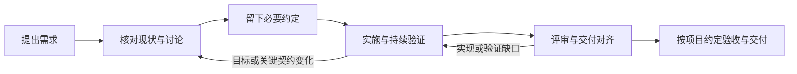

# Workflow-SOP · 轻量 AI 辅助研发流程

帮助团队把需求转化为经过验证、便于维护的交付：明确目标与边界，让开发者与 AI 自主实施，留下必要的事实、决定和验证结果。

[完整流程](docs/WORKFLOW.md) · [核心原则](docs/PRINCIPLES.md) · [工程规则](docs/ENGINEERING_RULES.md) · [AI 协作](docs/AI_COLLABORATION.md) · [参与改进](CONTRIBUTING.md)

**状态：公司通用流程试行稿，尚未证明适用于所有团队。** 本轮整理记录在 CHANGELOG 的 Unreleased，不代表发布稳定版本。适用于新功能、缺陷修复、重构与技术改造；无须安装服务、Web 工作台或工作流引擎，也不绑定模型、语言或操作系统。

## 从这里开始

1. 提供原始需求、目标项目和允许的操作范围；开发者或 AI 先检查现有实现与项目规则。
2. 讨论目标、Context、边界、关键决定和验收方式；小改动记在任务/PR，普通功能默认一份 SPEC，复杂任务按需要拆分。
3. 在已授权范围内实施和验证，影响目标或关键契约的变化再协调；结果和遗留按项目现有评审、验收与发布方式处理。

使用 AI 时，可以直接这样开始，无须填写一套状态 JSON：

```text
请使用我们约定版本的 Workflow-SOP。
目标项目：<仓库或已授权目录>
需求来源：<任务、文档或描述>
本轮授权：<讨论 / 实施，以及操作边界>
先核对项目规则和工程事实，将必要讨论结论放到现有任务或适用的文档中。
在授权范围内自主实施，执行与改动和风险相称的验证，说明结果、依据与未验证部分。
```

把示例中的来源与范围换成真实内容。项目使用方式见[项目接入](#项目如何接入)，中断后继续见 [AI 协作](docs/AI_COLLABORATION.md#中断与交接)。

## 完整链路



阶段用于说明责任、依据和结果，不要求每步审批，也不规定工具调用顺序。各阶段输入、产物、变更与完成判断集中在 [WORKFLOW](docs/WORKFLOW.md)，其他页面按需引用。

## 会留下哪些内容

| 任务情况 | 最小充分记录 | 示例 |
|---|---|---|
| 小改动，任务说明已足够 | 任务/PR 中记录目的、范围、验证与结果；TASK 模板可选 | [缺陷修复](examples/L1-bugfix.md) |
| 一般功能，单份文档可维护 | SPEC：Context、需求、关键设计、验证与交付 | [标准功能](examples/L2-standard-feature.md) |
| 需要分开协作的复杂任务 | 按实际需要拆 PRD、SDD、TEST-PLAN、DELIVERY；重大决定才写 ADR | [复杂任务](examples/L3-complex-feature/README.md) |

旧称 L1/L2/L3 可用于沟通文档规模，不需要登记等级才能开始。高风险增加适用的验证与评审，不自动增加文件数量。模板见 [templates](templates/README.md)；示例均为教学内容，不能冒充业务执行证据。

## 项目如何接入

在现有项目 README、开发指南或 AI 指令中引用一个明确的 Workflow-SOP commit 或已发布版本。通过 [PROJECT-RULES 模板](templates/PROJECT-RULES.md) 补充实际构建/测试命令、技术约定、资料与操作边界、评审和验收方式；项目已有等价说明时直接引用。

不必复制整套规范，不要求创建指定目录。源码、业务需求与维护文档留在目标项目或现有任务系统，原始证据使用项目现有 CI/资料存储；日志、缓存与凭据遵循项目自己的存储和访问规则。

本仓库的 AGENTS.md 是维护本仓库的 AI 入口；它不会自动应用到其他项目。团队使用受支持的项目指令机制或在任务中明确提供可访问的规范引用，AI 无法访问时如实说明。

## 仓库内容

| 入口 | 唯一职责 |
|---|---|
| [PRINCIPLES](docs/PRINCIPLES.md) | 为什么这样做、哪些取舍值得保留 |
| [WORKFLOW](docs/WORKFLOW.md) | 从需求到交付的完整过程与产物关系 |
| [ENGINEERING_RULES](docs/ENGINEERING_RULES.md) | 代码、注释、测试、契约与评审质量 |
| [AI_COLLABORATION](docs/AI_COLLABORATION.md) | AI 自主程度、上下文、决策与恢复 |
| templates / examples | 按需记录方式与完整使用示例 |
| [SOURCES](docs/SOURCES.md) | 来源、旧路径映射和可恢复历史 |

本仓库不提供 Agent/Session Runtime、任务数据库、Web、Codex CLI 封装或 Change Lens 实现。现有原生 AI 工具、项目构建测试和代码托管平台承担相应执行能力。

## 改进与检查

流程无助于决策、验证或交接时，可以删减或调整；不要为假设风险增加手续。反馈实际场景、影响和建议即可，见 [CONTRIBUTING](CONTRIBUTING.md)。

```powershell
pwsh ./scripts/validate-workflow.ps1
```

上述可选维护命令和 [CI](https://github.com/YIMO691/Workflow-SOP/actions/workflows/validate.yml) 仅检查 Markdown 结构、相对文件链接和当前入口是否完整，不验证业务验收或发布状态。使用这套流程无须先运行仓库脚本。

[变更记录](CHANGELOG.md) · [使用帮助](SUPPORT.md) · [安全反馈](SECURITY.md)

当前为私有内部协作仓库，未选择开源许可证；来源引用不扩大内容的分发权限。
