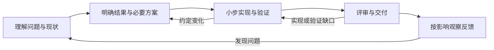

# Workflow-SOP · 日常研发协作

帮助开发者与 AI 把问题变成可验证、可维护的改动。先复用已有任务、代码、测试和评审记录，需要独立维护时再拆文档。

**当前是团队试行参考，尚未证明实际效率收益。** 适用于功能、缺陷修复、重构与技术改造；项目自己的权限、技术与发布要求仍然有效。

## 从这里开始

1. **理解问题与现状**：为什么改，现有行为是什么，允许改到哪里？先查项目事实。
2. **明确结果与必要方案**：怎样算做好，关键失败如何处理，哪些决定影响当前实施？将缺少的信息补回原记录。
3. **小步实现与验证**：交付可观察的行为，以实际测试和评审反馈修正；需求变化时更新原约定及受影响检查。
4. **评审交付与反馈**：说明完成、证据和遗留。涉及发布时安排相应观察与处置，结果回到原任务。

详细判断见 [完整流程](docs/WORKFLOW.md)。不需要先学习文档缩写或安装技能。项目初次采用时先补 [项目约定](templates/PROJECT-RULES.md)；已有等价内容直接引用。

```text
请按项目约定的 Workflow-SOP 处理这项任务。
目标项目与需求来源：<实际入口或描述>
本轮授权及边界：<实际允许的操作>
先核对现状和已有记录，只补影响实施与验收的缺口。
在授权范围内实现和验证，说明结果、证据及未完成项；需要发布时沿用项目安排。
```

## 完整链路



这是工作关系，不是逐步审批表；发布观察按任务影响安排，完成与遗留分别记录。

## 会留下哪些内容

| 当前需要 | 使用方式 | 例子 |
|---|---|---|
| 修一个明确问题 | 原任务或评审记录写目标、改动与检查结果 | [缺陷修复](examples/L1-bugfix.md) |
| 完成一个功能 | 在原记录补必要需求、方案和验收；缺少合适载体时用功能说明 | [收藏功能](examples/L2-standard-feature.md) |
| 多方需要独立维护内容 | 按实际需要拆需求说明、技术方案或验证计划，引用同一结果汇总处 | [异步导出](examples/L3-complex-feature/README.md) |

[选择记录模板](templates/README.md) · [变更后怎么重验](examples/L2-standard-feature.md#变更与重验示意) · [如何判断证据缺口](examples/L3-complex-feature/DELIVERY.md#按验收定位当前缺口)

## 项目如何接入

在项目现有开发指南或 AI 指令中引用明确的 Workflow-SOP 版本，补齐实际命令/环境、技术与资料边界，以及谁决定需求、技术风险、验收发布和异常处置。使用 [项目约定](templates/PROJECT-RULES.md) 记录缺少的部分，无须复制整套规范。

业务内容与运行证据留在目标项目允许的位置。本仓库的 AGENTS.md 只指导本仓库维护；在其他项目使用时需提供可访问的规范入口。

先在真实任务中试用，再按 [反馈方式](docs/WORKFLOW.md#用实际任务修订流程) 决定保留或删减哪些做法，不以模板填写完整作为推广依据。

## 按问题选择技能

澄清、设计、排查或评审遇到具体卡点时，查看 [可选技能推荐](skills/README.md)。它是方法参考，不自动安装或调用，也不要求重新生成已有约定。

## 仓库内容

[工程规则](docs/ENGINEERING_RULES.md) 用于代码、测试与评审判断；[AI 协作](docs/AI_COLLABORATION.md) 用于上下文、授权与交接；[核心原则](docs/PRINCIPLES.md) 解释取舍。[模板后的写作参考](templates/README.md#三种方法如何配合) 保留 arc42、C4 和 ADR；[来源与历史](docs/SOURCES.md) 保留版本与边界。示例都是教学内容，尚无业务执行证据。

## 改进与检查

反馈实际使用中的漏检、返工或重复劳动，见 [参与改进](CONTRIBUTING.md)。维护仓库时运行：

```powershell
pwsh ./scripts/validate-workflow.ps1
```

该命令及 [CI](https://github.com/YIMO691/Workflow-SOP/actions/workflows/validate.yml) 只检查文档，不判定业务验收。无需运行此命令才能使用流程。

[变更记录](CHANGELOG.md) · [使用帮助](SUPPORT.md) · [安全反馈](SECURITY.md)

当前为私有内部协作仓库，未选择开源许可证；来源引用不扩大分发权限。
