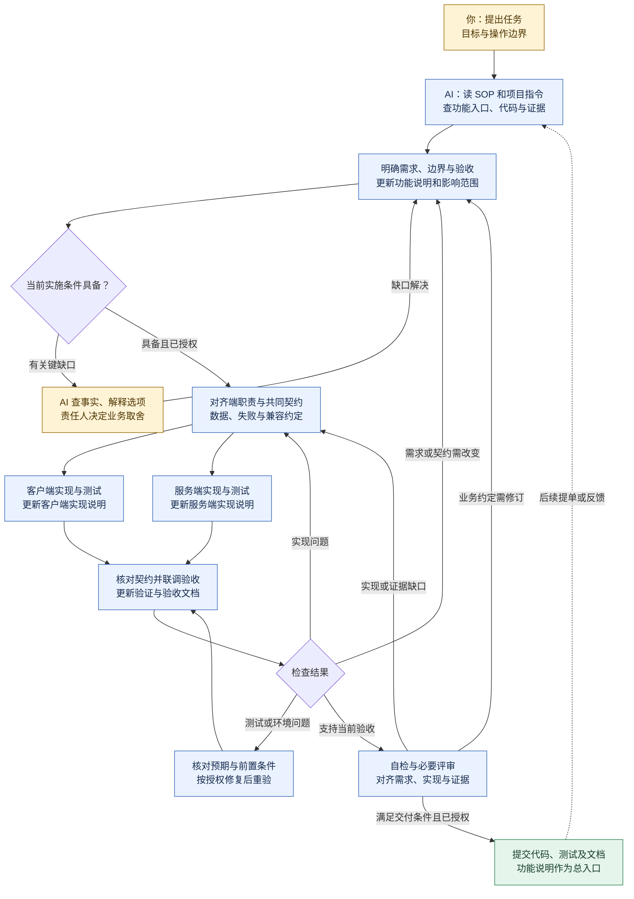

# Workflow-SOP

把这个仓库和任务交给 AI：先结合项目事实对齐需求，再用文档中的规则、实现依据和验收场景指导开发；根据验证与评审反馈修正，最终留下可继续维护的代码和记录。

**本仓库提供可按需取用的工作流思路。步骤、工具与文件组织可按任务和个人习惯调整；交付保留明确目标、真实验证及可定位的维护依据。** 具体裁剪见 [工作指南](docs/WORKFLOW.md#怎样裁剪)。

## 从这里开始

在能访问目标项目的 AI 会话中发送：

```text
Workflow-SOP 入口：https://github.com/YIMO691/Workflow-SOP/blob/main/README.md 。
优先沿用项目已采用的位置和版本；首次使用可读取此入口。仅在使用者选择跟随更新时，新任务读取 main 当前版本；同一任务保持已读版本。
从 docs/WORKFLOW.md 的“执行速查”开始，按 README 的读取表查涉及的细节。
先核对目标项目指令、代码和已有记录，在授权范围内完成任务；按速查说明实际结果与缺口。
任务：<描述要解决的问题，或提供已有提单>
```

**线上读取是可选方式，无需克隆仓库或手工拉取。** 使用者可以选择跟随线上更新、固定线上版本或继续用本地副本；未选择时沿用现有方式与版本，不自动升级。选择方式见 [线上读取与版本选择](docs/AI_COLLABORATION.md#线上读取与版本选择)。

当前仓库公开可读，但仍需核对所用 AI 工具能否取得正文；链接可见不代表工具已经读取。首次使用无须安装技能或部署服务，资料读不到时说明缺口，可使用允许提供的本地副本。公开访问不扩大引用资料或业务项目的授权。

## 完成后提交什么

交付应让后来的人和 AI 找到：当前规则是什么、两端怎样实现、重要选择的原因，以及哪些行为在什么版本得到验证。下一次提单从这个入口核对现状，再修改受影响内容。

**双端新功能：代码及相关测试 + 功能说明、客户端实现、服务端实现、验证与验收四类记录。** 它们承担不同维护职责；已有文件或章节能回答相应问题就直接复用。

以收藏功能为例，提交到目标项目已有文档位置：

```text
收藏功能-功能说明.md        ← 总入口：为什么做、规则、完整链路、相关文档
收藏功能-客户端实现.md    ← 界面、状态、交互、请求和恢复、代码入口
收藏功能-服务端实现.md    ← 校验、业务、数据、并发和恢复、代码入口
收藏功能-验证与验收.md    ← 验收场景、实际结果、证据、未验证项
```

文件名是示意，已有分端手册或测试记录可以直接对应；协议、配置定义和自动化测试引用原文件，不复制一套。**功能说明是后来的人和 AI 的第一阅读入口。** 具体写法见 [四类模板](templates/README.md) 和 [关联示例](examples/L2-standard-feature.md)。

| 这次做的工作 | 文档怎样交付 |
|---|---|
| 新的客户端与服务端功能 | 补齐四类记录的职责，沿用项目文件或章节并建立关联 |
| 扩展或修改已有功能 | 从功能入口梳理影响，更新受影响的需求、端实现和验证；变更记录关联本次提单/提交 |
| 仅一端的功能 | 保留功能说明、涉及端的实现及验证；说明未涉及另一端的依据 |
| 独立小修复 | 原提单或 PR 写目标、改动和验证；影响已有功能说明或设计时同步原文档 |

代码、测试和文档随本次工作提交到**目标项目**，提单或 PR 链接功能入口及证据；无需另写重复的任务、PRD、SDD 或交付报告。项目已有明确交付要求时沿用。

## 整个流程

文档随实施逐步补全。两端分支表示职责与记录，不要求并行 Agent 或分阶段交文档。



仅涉及一端时走相应分支，并核对共同契约是否仍兼容。条件不足只暂停受影响动作；反复失败没有新证据时调整诊断路线。提交、验收与发布分别按项目约定和授权处理，图中的回流不表示无限重试或逐阶段审批。详细条件见 [工作指南](docs/WORKFLOW.md)。

## 给 AI 的执行入口

首次采用先看本页链路图与下表；每个任务从 [执行速查](docs/WORKFLOW.md#执行速查) 和目标项目事实开始。表中按章节读取，信息足够后进入工作；无需每轮重读全仓。此仓库的 `AGENTS.md` 仅用于维护本仓库。

| 当前任务或问题 | SOP 最小读取范围 | 再补读的条件 |
|---|---|---|
| 每个实施任务 | 执行速查；目标项目指令、相关代码、功能入口和证据 | 按下列情况读取对应正文；项目要求仍适用 |
| 独立小修或文档维护 | [怎样裁剪](docs/WORKFLOW.md#怎样裁剪)、[交付与后续](docs/WORKFLOW.md#交付与后续) | 发现接口、权限或数据影响时，补读相应工程规则 |
| 新增或修改功能 | [维护功能说明](docs/WORKFLOW.md#维护功能说明)、[验证覆盖与方法](docs/ENGINEERING_RULES.md#验证覆盖与方法)、交付与后续 | 缺少记录时读 [载体选择](templates/README.md#按现状选择载体) 及涉及的模板；已有格式直接复用 |
| 验收措辞不清、结果缺证据、维护入口断链 | [三个正反例](examples/decision-examples.md) | 对照例子定位问题后，回到对应规则与原任务 |
| 检查失败、重要约定改变或任务中断 | [变化处理](docs/WORKFLOW.md#实施与变化处理)、[诊断](docs/ENGINEERING_RULES.md#检查没有给出结论时) 或 [交接](docs/WORKFLOW.md#中断与交接) | 只取当前异常涉及的章节 |
| 长期接入、选工具或核对来源 | [工具接入](docs/AI_COLLABORATION.md)、[技能推荐](skills/README.md) 或 [来源](docs/SOURCES.md) | 这些是专题参考，不在日常任务默认读取范围内 |

想先看一次工作怎样结束，读 [已完成的轻量维护案例](examples/completed-maintenance.md)；需要两端契约、未知结果恢复与后续需求分析时，再读 [收藏教学示例](examples/L2-standard-feature.md)。

## 实践复盘与优化提案

[排行榜实践复盘（公开整理版）](docs/reports/2026-09-16-workflow-retrospective.md)记录工作流搭建、代码生成质量研究、真实重构与用户纠偏；内部实现和原始证据未公开。[全流程优化方案](docs/plans/2026-09-16-workflow-optimization.md)给出生成前、生成中、交付及接续的补强位置、文件清单和分批验收。

这些是维护参考，不加入每次任务的必读范围。方案中的后续优化尚未实施；当前执行仍以工作指南和项目有效要求为准。

[获取帮助](SUPPORT.md) · [贡献与检查](CONTRIBUTING.md) · [变更记录](CHANGELOG.md) · [来源与历史](docs/SOURCES.md) · [安全说明](SECURITY.md)

团队试行参考，未验证普遍效率收益。公开协作仓库，未选择开源许可证，资料使用遵循原授权。
