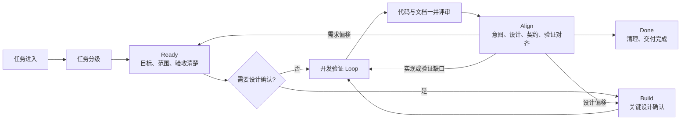

# 轻量研发工作流

Workflow-SOP 是供开发者与 AI 共同使用的轻量研发规范：从原始需求出发，完成必要设计、小步实现、风险验证与交付对齐，并留下后续维护需要的信息。

[开始使用](START-HERE.md) · [完整流程](SOP.md) · [文档与风险分级](TASK-LEVELS.md) · [贡献指南](CONTRIBUTING.md) · [版本变化](CHANGELOG.md)

版本：v0.6-draft（试运行：分端设计、代码质量与轻量 AgentWorkspace）

适用范围：新功能、功能迭代、缺陷修复、重构和技术改造

> 当前版本仍处于试运行阶段，并非已经定型的公司最终规范。它尚未在足够多的真实团队、项目类型和工具环境中验证。使用过程中如果发现步骤无效、成本过高、职责重复、描述不清、无法覆盖实际风险，或存在更轻量可靠的做法，请提出改进建议。

## 1. 目的

这套工作流用于让需求意图、关键设计、验证结果和必要的维护信息在开发过程中自然留下来。

它不要求所有任务依次编写 PRD、SDD、测试方案。任务先分级，再选择最低必要产物：

- L1 小改动：任务说明即可。
- L2 标准功能：一份 `SPEC.md`。
- L3 需求、设计与验证需分开维护的复杂项目：使用完整正式流程，包含 PRD、SDD、TEST-PLAN、DELIVERY；重大决策才写 ADR。

### 项目架构

| 部分 | 入口 | 职责 |
| --- | --- | --- |
| 使用入口 | [START-HERE](START-HERE.md)、[提示词](prompts/NEW-TASK.md) | 启动、接手和交付任务 |
| 流程与分级 | [SOP](SOP.md)、[TASK-LEVELS](TASK-LEVELS.md) | 定义阶段条件、文档规模和验证强度 |
| AI 与工程规范 | [AGENTS](AGENTS.md)、[AI-PLAYBOOK](AI-PLAYBOOK.md)、文档/代码/工作区规范 | 规定探索、执行、记录和存储边界 |
| 模板与示例 | [TASK](templates/TASK.md)、[SPEC](templates/SPEC.md)、[正式功能模板](templates/FORMAL-FEATURE/README.md) | 按需记录目标、设计、验证与交付 |
| 协作与检查 | [贡献指南](CONTRIBUTING.md)、[PR 模板](.github/PULL_REQUEST_TEMPLATE.md)、[Gate 用例](tests/workflow-gate/README.md) | 维护规范，检查链接、模板要求与部分状态一致性 |

日常使用是“原始需求 + 当前工程 + 授权边界 → 实现与验证 → 必要维护记录”。功能代码、构建、测试和发布由目标项目及其开发工具承担；本仓库提供共同遵循的规范、模板和检查工具。

## 2. 核心原则

1. 任务驱动，文档按需产生。
2. 只记录无法从代码中轻易还原的信息。
3. 统一最低结果，不统一个人思考和表达方式。
4. 文档与代码使用同一个任务和 PR/MR，不增加独立审批流。
5. 需求、设计、测试之间保持轻量关联，不建设复杂追踪系统。
6. 文档可以短，但目标、边界、关键决定和验收标准不能含糊。
7. 权威按信息类型划分；发生偏移必须解决，不能让过期文档或偶然实现自动成为全部真相。
8. 编码前区分事实、假设、待确认和阻断项；Hard Gate 依赖可复现证据或独立评审。
9. 产品意图保持一份，技术设计与验证按 Client/Server 影响拆分。
10. 文档规模和验证强度分别判断；局部高风险修复可以使用单份 SPEC 配合 CRITICAL 验证，具体见 [任务分级](TASK-LEVELS.md)。

## 3. 工作流总览



开发验证 Loop：

```text
选择最小行为 → 列测试 → Red → Green → Refactor → 回归 → 下一个行为
```

Gate 表示进入下一步所需满足的条件；Build 在本流程中表示必要设计确认，编译构建属于开发验证活动。普通任务没有独立 Build 审批。

TDD 指 Test-Driven Development，适用时采用上面的测试先行循环；视觉调整等不适合严格测试先行的场景使用明确的替代验证。测试代码和测试结果是主要证据，不额外生成 TDD 报告。

人负责产品意图、范围、授权及重要风险接受；AI 先检查工程，再推进已授权工作。按风险安排独立 Review，最终 Align 核对需求、设计、实现与证据；实施细节变化就地更新，需求或关键设计变化回到对应阶段确认。

### 文档规模与验证强度分别判断

| 选择 | 控制什么 | 典型结果 |
| --- | --- | --- |
| L1 / L2 / L3 | 信息需要如何维护 | 任务/PR、一份 SPEC、或分开维护的正式文档 |
| FAST / STANDARD / CRITICAL | 实际风险需要哪些验证与评审 | 定向验证、常规验证与独立 Review、或风险专项验证与 Owner 接受 |

例如，小文案调整可以是 L1 + FAST；普通收藏功能可以是 L2 + STANDARD；局部权限修复可以是 L2 + CRITICAL。增加验证强度不自动增加文档，具体条件以 [TASK-LEVELS](TASK-LEVELS.md) 为准。

## 4. 新人与 AI 入口

- 新人从 [START-HERE](START-HERE.md) 开始，不需要先读完所有规范。
- AI 编码工具读取 [AGENTS](AGENTS.md) 和 [AI-PLAYBOOK](AI-PLAYBOOK.md)。
- 新任务复制 [NEW-TASK](prompts/NEW-TASK.md)。
- 中断、换人或换 AI 时复制 [CONTINUE-TASK](prompts/CONTINUE-TASK.md)。
- 最终交付复制 [ALIGN-GATE](prompts/ALIGN-GATE.md)。

`AGENTS.md` 是自动入口，保持短小；完整的 AI 行为、输出契约、停止条件和证据规则集中放在 `AI-PLAYBOOK.md`，避免多处重复。

## 5. 工作流快速开始

1. 按 [新手入口](START-HERE.md) 提供完整可访问的工作流路径与目标项目，再按 [任务分级](TASK-LEVELS.md) 分别选择文档等级和验证档位。
2. 复制对应模板：
   - L1：[TASK](templates/TASK.md)
   - L2：[SPEC](templates/SPEC.md)
   - L3：从 [正式功能模板包](templates/FORMAL-FEATURE/README.md) 开始，使用 [PRD](templates/PRD.md)、[SDD](templates/SDD.md)、[TEST-PLAN](templates/TEST-PLAN.md) 和 [DELIVERY](templates/DELIVERY.md)
3. 满足 Ready 后开始实现；涉及关键设计确认的任务先满足 Build，按选定风险档位验证和评审。
4. L1/L2 在任务或 PR/MR 中完成 [交付检查](templates/DELIVERY-CHECKLIST.md)；L3 在 DELIVERY 中汇总实施、测试、偏移和最终对齐。
5. 只有独立审计需要时才额外使用 [对齐记录](templates/ALIGNMENT-GATE.md)。
6. 重大技术选择单独复制 [ADR](templates/ADR.md)。

书写与工程细则：

- [Markdown 文档与 Client/Server 分端规范](DOCUMENTATION-GUIDE.md)
- [代码、注释与复杂度规范](CODE-GUIDE.md)
- [AgentWorkspace 工作区规范](AGENT-WORKSPACE.md)

完整规则见 [研发 SOP](SOP.md)。

## 6. 文档职责

| 产物 | 回答的问题 | 何时需要 |
| --- | --- | --- |
| TASK | 改什么、为什么、如何验收 | L1 |
| SPEC | 需求、设计、测试如何形成一个完整功能 | L2 默认 |
| PRD | 为什么做、为谁做、做什么 | L3 |
| SDD | Client/Server 如何实现、如何失败和恢复 | L3 按受影响端实例化；L2 在 SPEC 中覆盖相关设计 |
| TEST-PLAN | 如何系统验证质量与发布条件 | L3 分开维护；L1/L2 在现有记录中说明验证方式 |
| ADR | 为什么选择这个关键方案 | 存在重大、长期或难逆决策时 |
| DELIVERY | 交付基线、最终实现、测试结果、偏移、Align 和交付决定 | L3 正式流程 |
| DELIVERY-CHECKLIST | 是否真正完成并清理干净 | L1/L2，可放在 PR/MR |
| ALIGNMENT-GATE | 独立审计时记录权威来源与交付一致性 | 仅审计要求按需使用 |
| START-HERE | 新人如何在几分钟内启动 AI | 新人首次使用 |
| AGENTS / AI-PLAYBOOK | AI 自动入口与执行协议 | AI 参与分析、设计、实现或评审 |

正式功能保持一份 PRD 和 DELIVERY；两端都存在独立设计复杂度时才拆 CLIENT-SDD / SERVER-SDD，并引用同一个可执行契约。TEST-PLAN 写验证计划，DELIVERY 写实际结果，分端细则见 [文档规范](DOCUMENTATION-GUIDE.md)。

功能代码与长期维护文档跟随目标项目版本管理；原始日志、截图和检查点放流水线或外部工作区，临时物按存储规则隔离。外部目录按需创建，参见 [AgentWorkspace](AGENT-WORKSPACE.md)。

交付时分别说明实现状态、验证状态和发布就绪程度。Done 要求当前确认范围内的阻断级 AC（验收标准）通过；修改后的重验与例外处理以 [SOP](SOP.md) 为准。

## 7. 示例

- [L1 缺陷修复](examples/L1-bugfix.md)
- [L2 标准功能](examples/L2-standard-feature.md)
- [L3 复杂功能](examples/L3-complex-feature/README.md)
- [Align Gate 试运行](pilots/DOC-ALIGNMENT-GATE/00-TASK.md)
- [AI 操作层试运行](pilots/AI-OPERATION-LAYER/SPEC.md)

研究与演进依据见 [2026 AI Harness 与轻量研发工作流研究报告](research/2026-AI-HARNESS-WORKFLOW-REPORT.md)。研究与试运行记录保留当时基线；当前执行规则以 SOP、TASK-LEVELS 和 AI-PLAYBOOK 为准。教学示例中的结果不能作为真实项目的验证证据。

## 8. 分层权威

- TASK/SPEC/PRD：需求目标、范围、业务规则和验收标准。
- SPEC/SDD：关键设计、边界、失败语义和兼容策略。
- ADR：重大选择及其理由。
- 接口定义、Schema、迁移和配置校验：公共契约的机械事实。
- 测试、代码和运行证据：当前实现及线上实际状态。

文档对意图和设计具有规范性权威，但不能替代对代码和运行事实的检查；代码反映当前实现，也不能未经确认自行改变产品意图。完整规则见 SOP 的 Align Gate。

## 9. 维护方式

- 模板与 SOP 一起版本管理。
- 流程问题在实际任务复盘中提出，不为假设场景提前增加章节。
- 新增强制项必须说明它防止了什么真实风险。
- Gate 规则修改必须提供正向和反向回归夹具，防止流程出现 false-green。
- 连续多次无人使用或无法产生价值的字段应删除或降为可选。
- 若任务系统已经维护负责人、状态、评审人等元数据，模板中的重复字段可以删除。

### 如何提出优化建议

不需要单独填写正式提案。在任务评论、复盘或工作流维护记录中说明以下内容即可：

```text
任务类型和等级：
使用到的流程或模板：
遇到的问题：
造成的实际影响：
建议如何调整：
可验证的案例或证据：
```

以下情况尤其值得反馈：

- 同一信息需要在多个地方重复维护。
- 某个字段或 Gate 无法帮助决策、评审、验证或交接。
- 为满足模板而编写了无人使用的内容。
- AI 或新人容易误解流程、选择错误等级或过度生成文档。
- 实际缺陷、返工或事故没有被现有流程发现。
- 某项检查可以由代码、测试、Schema 或自动化工具替代。

改进建议应优先减少重复和无效成本。除法规、安全、审计或已发生风险明确要求外，不因个人偏好增加新的强制文档和审批环节。

## 10. GitHub 协作

- 贡献方式见 [CONTRIBUTING](CONTRIBUTING.md)。
- 使用问题见 [SUPPORT](SUPPORT.md)。
- 敏感问题按 [SECURITY](SECURITY.md) 私密报告。
- 重要版本变化记录在 [CHANGELOG](CHANGELOG.md)。
- 所有 PR 使用仓库模板并运行 `pwsh ./scripts/validate-workflow.ps1`；该命令同时执行工作流 Gate 反例回归。
- Gate 回归用例及扩展规则见 [tests/workflow-gate/README.md](tests/workflow-gate/README.md)。

### 自动化覆盖与版本状态

[GitHub Actions](https://github.com/YIMO691/Workflow-SOP/actions/workflows/validate.yml) 在 PR、推送 main 或手动触发时检查 Markdown、相对文件链接、模板要求和部分交付状态一致性。检查通过不代表业务行为正确、风险覆盖充分或已经具备发布条件；目标项目仍需执行自己的构建、测试和评审。

`main` 是当前协作基线，版本仍为 `v0.6-draft` 试运行；合并到 main 不等于发布稳定版。已合入的主要优化见 [PR #1](https://github.com/YIMO691/Workflow-SOP/pull/1) 和 [PR #2](https://github.com/YIMO691/Workflow-SOP/pull/2)，版本变化以 CHANGELOG 与后续 Tag/Release 为准。

当前仓库用于私有内部协作，未附加开源许可证。未经所有者明确授权，不得将内容视为可公开分发或再许可。
