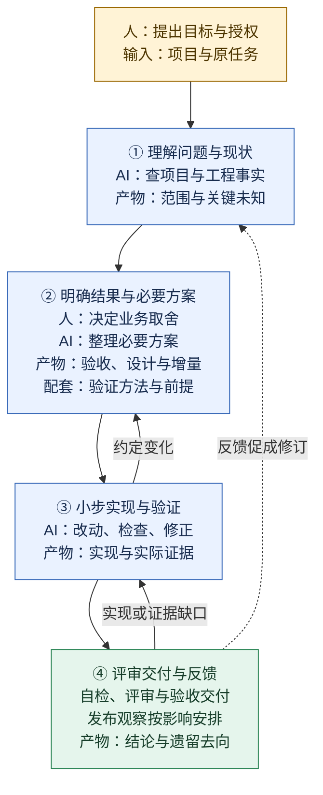
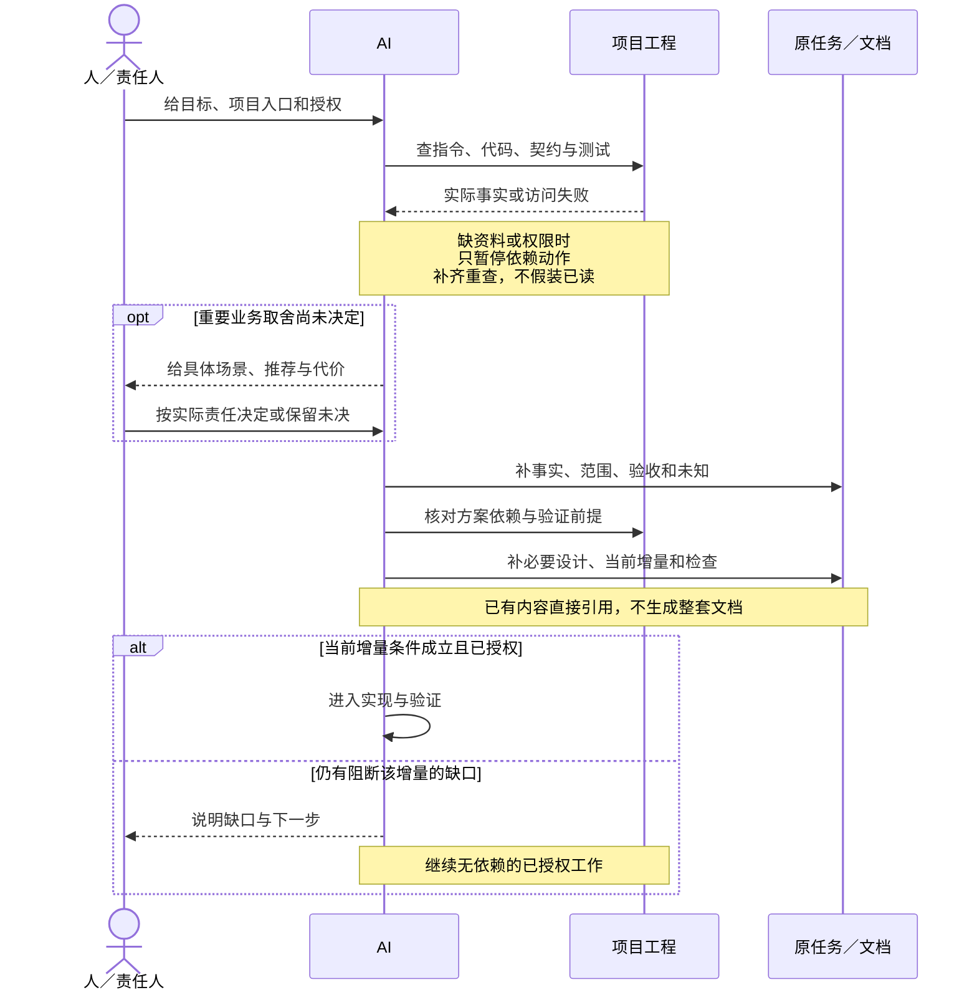
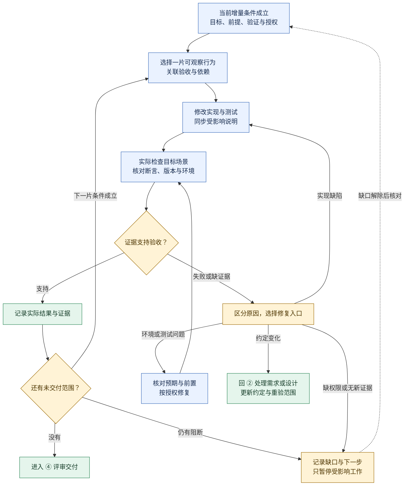
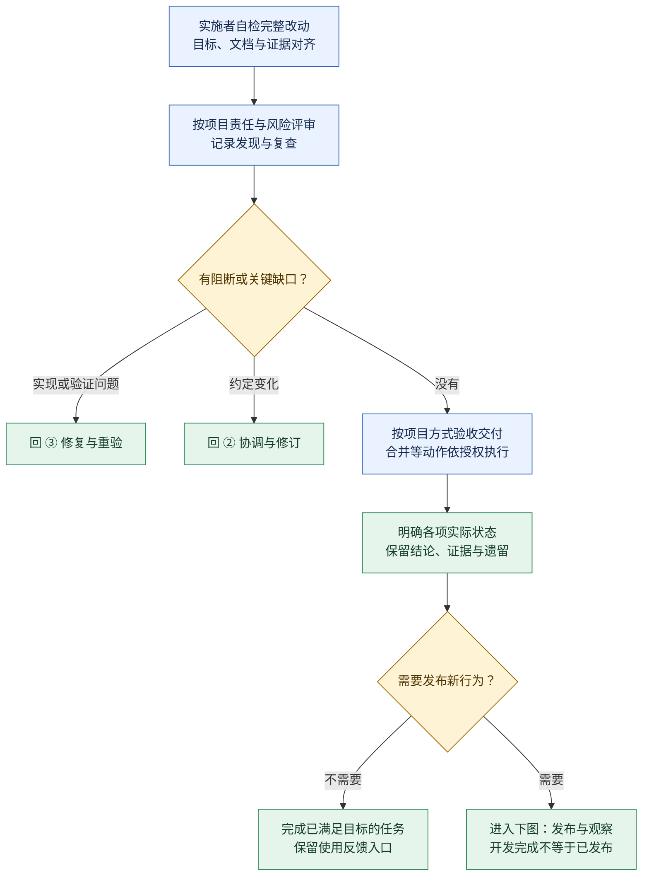
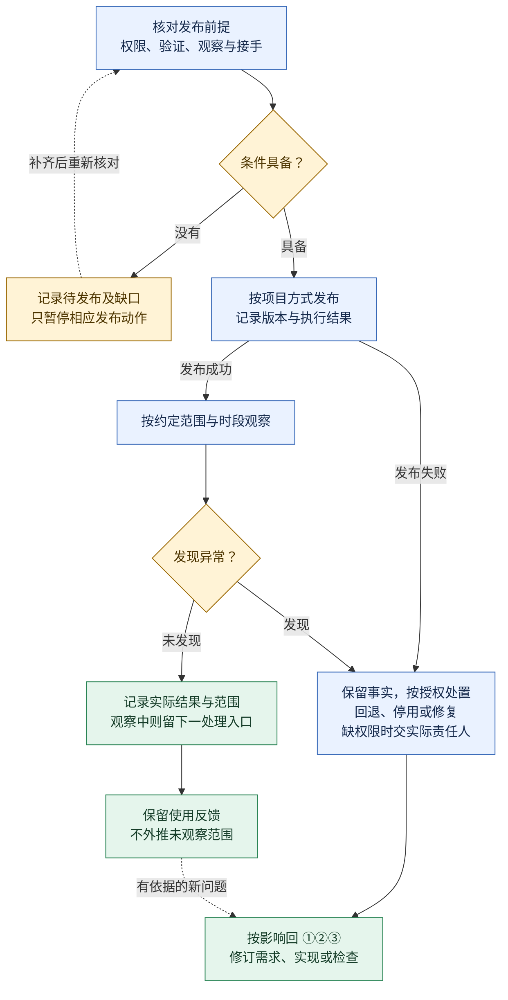
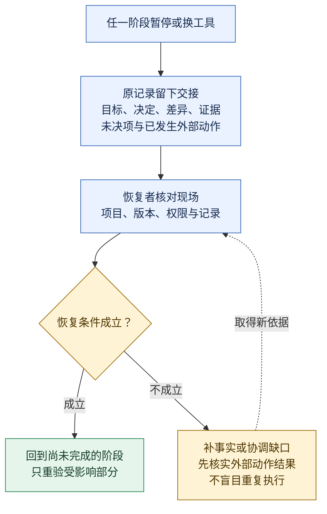

# 从需求提出到可信交付

本文件是完整流程的唯一正文。阶段帮助定位工作，不构成必须逐个点击的状态机。角色可以由同一人兼任；评审与验收沿用目标项目的责任安排，无须所有工作都由同一位负责人再确认一次。

初次使用从 [README](../README.md#从这里开始) 开始。想看人与 AI 的分工、产物和异常回流，直达本页 [全链路图](#完整链路)；需要具体写法时再查 [收藏功能演练](../examples/L2-standard-feature.md#完整运行演练)。

按问题跳转：[澄清](#需求与现状) · [记录选择](#约定与文档选择) · [处理变化](#实施与变化处理) · [交付判断](#评审交付对齐与完成判断) · [运行反馈](#发布后的观察与反馈)。

## 过程与责任

| 工作阶段 | 需要解决的问题 | 实际参与者 | 保留的结果 |
|---|---|---|---|
| 理解问题与现状 | 为什么做，现有事实与未知是什么 | 需求方、开发者与 AI；按需参与的测试人员 | 来源、现状与待决定事项 |
| 明确结果与必要方案 | 做到什么，当前能否实施，怎样验证 | 业务/技术实际决策人与实施者 | 验收、范围、关键设计与验证安排 |
| 小步实现与验证 | 如何达到目标，反馈和变化怎样处理 | 开发者与 AI，按任务需要协作的人员 | 实际改动、验证结果及约定变化 |
| 评审交付与反馈 | 结果能否接受，如何交付和处理后续问题 | 实施者、适用评审者、验收/发布及观察承担者 | 结果、证据、遗留；涉及时保留发布观察反馈 |

代码编写与验证通常交替进行；需求不清回讨论，实现有误就修复，环境失败先核查环境。对无依赖的已授权工作可以继续，不要求整项任务等待一个无关问题。

### 项目责任如何落实

项目接入时在已有约定中明确：谁决定业务范围与验收预期，谁承担技术方案/风险与评审责任，谁有验收/合并/发布权限，发生分歧或运行异常由谁接手。使用实际人或已有团队，可兼任；这不是要求设立新岗位或逐步审批。填写入口见 [项目约定](../templates/PROJECT-RULES.md#团队协作与交付)。

任务沿用这些安排，只记录变化。责任暂缺时先查已有制度与维护记录，仍无法确定就找项目负责人协调；只暂停依赖该决定的动作，其余已授权工作可继续。AI 可以提供分析与审查意见，不能自行成为业务风险接受人或批准人。

## 需求与现状

输入可以是任务卡、策划文档、截图、已有问题或直接描述。实施者先检查目标项目的指令、代码、配置、接口和测试；能从工程发现的信息不反复要求需求方提供。

讨论结论优先补回现有任务或需求记录：

- **来源与当前事实**：需求出处/版本、现有行为及观察依据，代码位置和项目约束。
- **目标与验收**：可观察的用户或系统行为；多项要求需要引用时再编号 AC-01 等。
- **范围与边界**：本次包含、不做的内容，以及授权路径或操作限制。
- **关键设计与理由**：采用什么方案、为什么；有实际影响时记录替代方案与取舍。
- **验证预期**：如何观察目标是否实现，哪些检查需要项目外资源或人工判断。
- **未知与决定**：区分事实、可验证假设、待确认事项和真正阻断当前工作的缺口；可以用普通语言，无须统一状态 JSON。

成熟案例只在相关时参考，记录来源、采用理由和适用限制。不要因为案例范围更大就扩大本次需求。重要结论应进入可持续记录，完整聊天、模型内部推理和每次工具调用不属于必交文档。

### 用场景澄清，再决定是否继续提问

先区分三个对象：当前实现的事实、希望改变的行为、尚待决定的业务取舍。实现与需求冲突时，代码说明“现在怎样”，不自动决定“应该怎样”。对真正有分歧的方案说明推荐、可行替代、各自代价和需要的决定，不为形式凑足方案数量。

同一个词可能隐藏不同结果。例如“取消”是停止等待请求，还是撤销已保存的关系？把两种解释放进同一时序，写出刷新后应看到什么，再将决定记入原规格。已有术语表则引用；重要决定只有难逆转、未来缺理由会费解且存在真实取舍时，才值得另写 ADR。

按决策依赖提问：是否允许离线修改未定时，先不问重连冲突策略；前提已确定、互不影响且容易回答的少数问题可以同轮讨论，复杂选择分开。已有决定不重问，查得到的事实自行核对。当前增量的结果、边界、主要失败行为和验证方式已经清楚，且无阻断当前动作的未知或权限缺口，就停止澄清；未来分支保留去向，不要求穷举整个产品。

需要访谈辅助时按 [skills 推荐](../skills/README.md) 选择；工具里的“访谈结束”不替代本节的实施条件。

## 约定与文档选择

目标、边界、验收和必要业务选择清楚，且已有实施授权时，可以开始。普通实现细节允许边做边确认，不增加单独的 Ready/Build 审批。

| 情况 | 推荐载体 | 结果写在哪里 |
|---|---|---|
| 小改动，说明很短 | 原任务或 PR；任务说明模板可选 | 同一记录 |
| 普通功能 | 复用原任务/文档；没有合适载体时用单份功能说明 | 原记录或交付 PR，选择一个汇总处 |
| 需求由多方协作、需要独立维护 | 拆出需求说明，其他内容在原处引用 | 原交付汇总处 |
| 跨系统责任、迁移或难逆设计，需要独立讨论维护 | 拆出技术方案；重要决定按需单独记录 | 原交付汇总处 |
| 测试环境、资源或多人验证需要协调 | 拆出验证计划 | 实际结果在原记录；需要集中多方结果时用交付记录 |

较高风险的局部改动也可以只用原记录，增加适用验证而非文件。需求和设计已清楚时直接实施，不再生成一份总结以满足模板。旧 L1/L2/L3、PRD/SDD 等名称只用于兼容，含义见 [记录选择](../templates/README.md)。

独立拆出需求或技术方案后，原记录对应内容改为引用，保持一个维护位置；文件名不决定是否具备实施条件。

文档不自动生成下一层强制文件。项目规则、任务文档与现有工程事实共同指导开发者/AI；不要求转换成特定 Prompt 管线、Agreement 数据库或专属 AGENTS 文件。

### 保持文档有效

需求、设计和验证由项目已有责任人维护；负责人、日期和状态已有任务系统管理时直接引用。阅读者要能辨认当前适用版本、尚未决定的提案及已被替代的内容。不要把模板占位或 AI 草稿写成已确认约定。

行为、验收、契约、部署条件或关键设计变化时，在同一变更中核对受影响的文档和检查；按任务引用能追溯即可，不要求另建追踪矩阵。接口字段引用项目实际维护的契约，设计正文解释语义、取舍和兼容，不复制另一份字段表。过时决策保留理由并指向替代记录；任务完成后，将仍需使用的说明留在项目维护入口，任务记录链接过去。

例如异步导出的“提交快速返回”需关联提交路径的设计与测量条件；增加同步权限查询后，既要复查耗时，也要更新该设计和受影响的验收证据。只修改日期不能让旧文档重新有效。

### 按可验证行为安排增量

普通功能优先切成贯穿必要模块、能独立观察结果的行为。每片只需说明：交付什么、对应哪项验收、真正依赖什么、怎样检查。前后端可以分工，验收仍连接同一条路径；仅按“数据库、接口、界面”分别完成，可能将集成问题推到最后。

例如先打通收藏、保存后读取和账户隔离，再补取消与失败恢复。第一片通过只支持该片的范围，原需求里的其他行为仍待交付。支撑性迁移或脚手架可作前置任务，但注明它尚不能单独证明哪项业务验收。完整教学记录见 [收藏功能说明](../examples/L2-standard-feature.md)。

依赖只记录真实阻塞；没有依赖不代表可以并行修改同一文件或共享状态，实施者仍需确定集成责任。广泛机械重构、跨版本迁移不强制套行为切片，按 [契约与迁移规则](ENGINEERING_RULES.md#设计契约与分端协作) 安排。后续增量保留目标和依赖，详细实现等前置结果明确后再写，不提前编造尚不存在的接口。

## 实施与变化处理

开发者与 AI 在授权范围内自主选择检查顺序和实现增量。核心规则和缺陷适合时采用测试先行；以真实反馈调整实现。具体规则见 [工程规则](ENGINEERING_RULES.md)。

| 实施中发生的变化 | 处理方式 |
|---|---|
| 普通技术细节调整，不改变目标与重要契约 | 继续实施，更新确有维护价值的说明 |
| 用户行为、范围、验收或授权改变 | 找实际责任人协调，在原记录更新约定 |
| 公共接口、数据迁移或重要设计取舍改变 | 核查影响、兼容与风险，按项目方式进行必要设计讨论 |
| 实现不符合约定 | 修代码并重新验证受影响行为 |
| 工具、依赖或环境失败 | 记录实际失败，修复后重试；不冒充业务测试通过 |

如果实现遵循计划却违背已确认需求，先核对当前规格、计划和实际差异：计划写错则在原目标内修正计划与实现；真正改变业务要求才重新协调。不能以“按计划做了”驳回有效缺陷，也不能只改规格去迎合错误实现。受影响的验收、契约、后继任务和检查一起核对，其余有效成果保留。

重要决定随实施更新，不等最后集中倒填。旧验证结果仅在相关源码、配置、环境及影响范围仍适用时引用；有改动就重新验证受影响部分，不机械运行所有历史测试。

## 评审、交付对齐与完成判断

实施者先自检。按项目已有规则与真实风险安排评审；跨模块、重要数据/权限或难回滚变化需要适当的独立检查。评审者可以是具备上下文的同事或按项目允许使用的独立 AI；不把同一作者换一段提示词当作充分独立证据。

交付对齐在原任务、功能说明、交付 PR 或交付记录中完成，关注：

1. 确认的目标和验收行为是否都有对应实现及适用验证。
2. 关键设计、可执行契约和文档是否反映最终结果。
3. 验证实际执行了什么，结果与代码版本/环境是否仍匹配。
4. 必要代码、注释、临时内容和失效文档是否清理。
5. 未验证项、已知限制和后续事项是否明确。

结果记录可以很短。例如“已覆盖正常与重复输入；新测试通过；旧版本客户端兼容尚未验证，因此本轮不能宣布可发布”。不要求固定表格、另写对齐报告或录入固定阶段状态。

编译通过只说明相应构建成功；测试通过仅支持其覆盖场景；审查通过不保证无遗漏。若与目标有关的关键验证缺失、失败或存在未解决的阻断问题，应说明尚未完成及下一步。

不阻断约定目标的限制可以由相应责任人理解后接受，并保留后续处理。不能通过删除原验收项、降低断言或将阻断问题改名为“例外”制造完成；若目标确实变化，先记录真实的新约定。

最终按项目已有方式验收。任务完成、代码合并、进入 QA 和发布分别描述；没有发布授权或发布证据，不宣称已发布。流程不新增一次统一的负责人审批，也不替代团队已有权限要求。

## 发布后的观察与反馈

涉及部署、上线或向用户交付新行为时，在原交付/发布记录说明：观察什么用户行为或运行信号、从何处取得、在什么范围/时段观察、什么现象需要处理、谁接手以及有何处置权限。已有监控和值班安排直接引用，不为每个任务建立报表或监控系统；文档与无运行影响的小改动可省略运行观察。

时段和阈值依据实际使用条件与影响确定；没有可靠数值时，写明可判断的异常及待确认条件。关键运行风险无人接手时，不推进依赖该安排的发布；观察尚未结束则说明已发布、观察中及下一次处理入口，不无限悬置已经完成的开发工作，也不提前宣称运行验证通过。

发现问题时保留适用版本、触发条件与脱敏观察，按项目已授权的停用、回退或修复方式处理；遇到授权缺口交由相应责任人决定。实际结果回到原任务，必要时修订需求、方案、验证或项目约定。教学写法见 [导出观察安排](../examples/L3-complex-feature/DELIVERY.md#发布观察的填写示意)。

### 用实际任务修订流程

初次采用时，从日常真实任务中选择能覆盖不同问题的少数案例，例如缺陷修复、普通功能和接口变更；没有固定数量要求，也不因本 SOP 自动获得业务项目的写入/发布授权。在原任务简记“用了哪条做法、减少了什么遗漏或增加了什么负担、有哪些实际证据”。

当出现重复记录、无效等待、漏检或交接困难，带具体例子按 [贡献方式](../CONTRIBUTING.md) 提议保留、调整或删除。缺陷数量或耗时变化需结合任务差异解释，一次顺利交付不证明普遍效率提升。模板和文档 CI 通过不替代这种采用反馈。

## 产物与存储

| 内容 | 推荐位置 | 避免重复 |
|---|---|---|
| 来源、讨论结论与验收约定 | 现有任务或项目需求文档 | 不自动复制完整原始资料 |
| 现状、设计、关键选择 | 功能说明/技术方案，重大选择用决策记录 | 不抄可生成接口字段 |
| 代码、配置、测试代码、维护文档 | 目标项目版本库 | 不拷入通用规范仓库 |
| 实际验证结果与评审意见 | 现有 CI、PR 或项目证据存储 | 交付只写摘要和可访问引用 |
| 中断/交接信息 | 现有任务记录 | 无跨会话需要就不建额外检查点 |
| 缓存、中间产物与原始大日志 | 项目允许的临时/证据位置 | 不提交凭据或过程缓存 |

任务编号、负责人、状态已有系统管理时直接引用。Markdown 是推荐的可版本化载体，等价的现有团队文档或任务工具也可以承载相同信息。项目适配见 [项目约定](../templates/PROJECT-RULES.md)，恢复方式见 [AI 协作](AI_COLLABORATION.md#中断与交接)。

## 完整链路

**先看主线，再展开需要的环节。** 每个阶段同时写明动作和留下的结果；带条件的回流箭头表示发现问题后回到哪里，不表示每次都重走流程。

人参与业务取舍、授权与必要验收；AI 在已授权范围内连续推进，不要求逐框批准。Codex、Claude Code 等原生工具执行搜索、编辑和命令；项目约定、可用工具与真实反馈支撑整个过程，无须额外搭建运行框架。具体条件见本页各节。

<strong>展开 ①②：输入怎样变成可实施的约定？看人与 AI 的分工</strong>

**本段产物**：原任务或功能说明中的验收、必要设计、增量和检查方式。需要独立维护才拆 [需求说明、技术方案或验证计划](../templates/README.md#各文档解决什么问题)。记录的是已知与待定，不是一次自动批准。

[实施条件](#约定与文档选择) · [AI 接入](AI_COLLABORATION.md#首次接入)

<strong>展开 ③：实现和验证怎样循环？失败、卡住、需求变化分别去哪里</strong>

**本段产物**：真实改动、测试与证据，留在原任务和项目版本库。命令成功不等于验收充分，一片通过不等于整个任务完成；不能靠删断言、改目标或一直重跑制造通过。

[验证与失败诊断](ENGINEERING_RULES.md#检查没有给出结论时) · [变化处理](#实施与变化处理)

<strong>展开 ④：怎样从改动走到交付？何时完成，何时仍待发布或观察</strong>

仅在本次需要发布时继续，发布观察不是所有任务都必须运行的阶段：

**本段产物**：当前范围内的交付结论、证据、遗留及必要发布观察。开发完成、已验收、已合并、已发布和观察结束分别描述；图中的“无阻断”要有事实依据，不是 AI 自评。

[完成判断](#评审交付对齐与完成判断) · [发布观察与反馈](#发布后的观察与反馈)

<strong>展开共用侧路：暂停、换人或换 AI 后，怎样接回原链路</strong>

[交接字段与恢复规则](AI_COLLABORATION.md#中断与交接)。需要技能时按当前缺口选一个方法，产物回原记录；[技能推荐](../skills/README.md) 不是另一个必经阶段。

想看一项任务如何填写上述结果，再读 [收藏功能演练](../examples/L2-standard-feature.md#完整运行演练)；它是可选的教学案例，不是理解主线的前置阅读。
