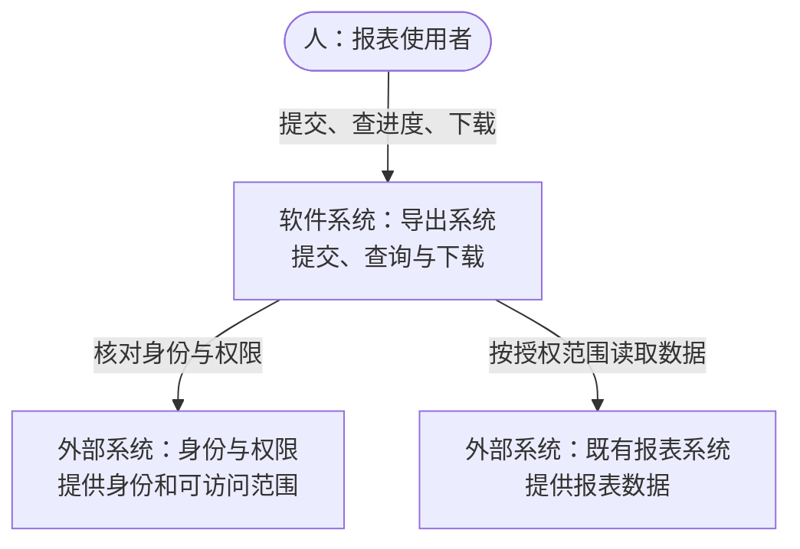
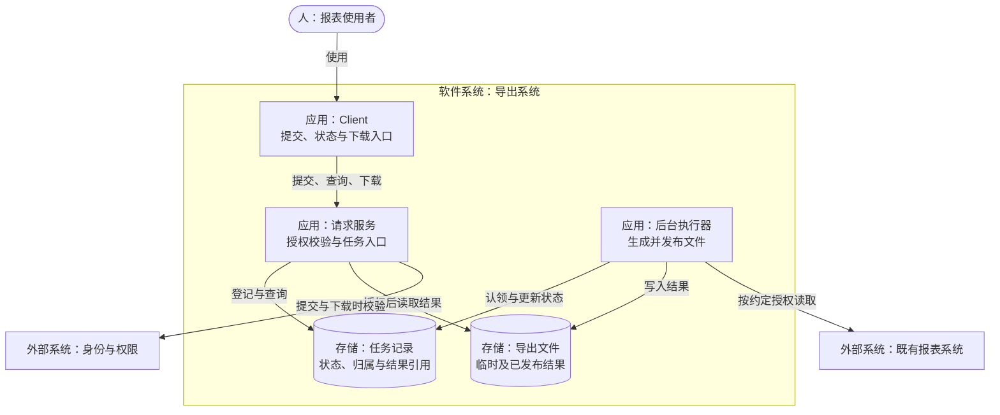

# 示例设计：持久化导出任务

依据 [PRD](PRD.md) 的教学需求，假设项目已有身份与权限服务、数据库和后台执行设施；这些能力在真实任务中需要先检查确认。

本例按 arc42 的关注点组织：目标/约束引用 PRD，结构用下面的 C4 视图，运行场景用有序文字，部署用映射表，质量与风险连接验收，选择理由进入 ADR。内容对应方式见 [SDD 模板](../../templates/SDD.md#用-arc42-组织本说明)。这是自写教学设计，不是实际项目架构盘点或完整 arc42 文档。

## C4 视图

以下两图共用一个“导出系统”范围。为演示职责，假设导出系统拥有 Client、请求服务、后台执行器、任务记录和文件存储；身份权限与既有报表系统在本次设计范围外。“外部”不表示公网或第三方，存储也不表示必须新建数据库。真实项目应按现有所有权与运行边界调整，不能据图拆出新微服务。

### 系统上下文图

面向需求方与开发者，回答谁使用系统、系统依赖谁。图例：括号节点是人，矩形是标注类型的软件系统；箭头表示发起使用/依赖的方向，回传信息省略，不表达执行顺序。

### 容器视图

面向开发与运维，展开同一导出系统。图例：边框是系统范围，内部矩形是应用运行单元，圆柱是数据存储；外部矩形仍是软件系统。箭头标明调用或读写目的，返回省略。本图采用 Mermaid 表达 C4 概念；技术栈与通信协议均待检查实际项目后填写，不代表可直接实施的接口定义。

为保持路径具体，本图演示请求服务校验后读取文件并回传，Client 不直接读任务库或文件存储。若真实项目采用直链下载，须另查权限撤销与地址失效的语义，不能沿用本图推断安全。后台授权究竟取提交时快照还是执行时复查仍待业务决定，图中的“按约定授权”不解决这个未知。图只表示逻辑运行边界，不表示机器数量、实例数量或高可用能力。

## 方案与责任

请求校验权限和参数后持久化任务，由后台执行器生成文件；Client 展示排队、运行、成功和失败状态，并处理查询/下载失败。Client 与 Server 引用同一接口契约，示例不复制机械字段或伪造代码链接。

任务唯一性与重复请求复用由持久化约束保证。后台任务认领有可恢复的归属和有效期，发布结果检查任务状态，避免重试重复发布。实际事务边界需结合目标项目设施细化。

## 运行场景与质量依据

以下是拟议路径，尚无运行结果：

1. Client 提交参数；Server 校验提交权限，登记或复用任务并返回标识。导出正文的生成留给后台，不放进提交请求。
2. 后台执行器认领任务，按约定的授权语义生成临时结果，再检查认领有效性并发布结果。写文件与更新数据库不能假定为同一事务；两者之间崩溃时如何对账需在目标设施中明确。
3. Client 查询自己任务的状态，成功后申请下载；Server 重新校验权限和有效期。提交响应丢失时，按同一业务提交身份查询/复用，不能让 Client 因未收到标识直接创建另一项任务；PRD 的 10 秒去重窗口不覆盖窗口外仍未知的结果，查询身份、保留期限及窗口外处理仍待设计与需求协调；不能只扩大重试次数。

[PRD](PRD.md) 的 AC-01 给出教学目标“正常条件下 2 秒内返回任务标识”。本设计通过分离生成路径减少提交的阻塞，但权限服务、数据库排队仍会拖慢响应。测量前需明确数据规模、并发、环境、统计口径，以及从客户端发出还是服务端接收到返回作为计时边界；当前“正常条件”不完整，不能据此宣称性能可验收。若实际测量超时，先区分网络、权限查询、任务登记与排队耗时，再定位改动并重验，不先添加缓存绕过权限语义。

## 部署与恢复的待决范围

拟复用现有请求服务、后台执行器、数据库和文件存储。实际接入先核对各运行单元的权限、连接配置及部署关系，新增基础设施须有单独的实际理由。

下表是部署映射的写法示意，尚无实际主机、环境或连接配置；测试环境与生产环境必须分别核对，不能用同一张逻辑图代替。真实部署信息留在项目允许的位置，不在通用案例填写机器名或凭据。

| 图中运行单元 | 拟映射到的现有设施 | 接入时需要核对 |
|---|---|---|
| Client | 现有客户端发布渠道 | 旧版本存续时间，是否理解异步状态和错误 |
| 请求服务 / 后台执行器 | 现有服务进程与后台执行设施，是否同机待查 | 是否独立部署/重启、访问权限、停止认领与未完成任务处置 |
| 任务记录 | 现有持久化存储的任务数据区域 | 事务与唯一约束、新旧程序能否并存读取、恢复能力 |
| 导出文件 | 现有文件/对象存储中获准的区域 | 写入与读取权限、结果发布、到期清理及失败观察 |

任务记录或接口升级须覆盖新旧服务并存；发布前明确谁仍使用同步入口、任务是否能被旧执行器读取、停止旧路径后未完成任务如何处置。回退请求服务版本不等于已经恢复任务数据或生成中的文件，需选择兼容回退或前滚修复并演练适用路径。24 小时保留与清理沿用 PRD 的教学约定；清理故障、状态与文件不一致、认领过期分别要有能定位任务的脱敏观察依据。部署顺序与恢复步骤尚未验证，不能直接当生产操作手册。

## 质量场景与未决风险

质量目标仍以 [PRD](PRD.md) 的 AC 为准，本表只解释设计影响和缺口；运行检查在 [TEST-PLAN](TEST-PLAN.md) 维护，不复制测试结果。

| 要保护的行为 | 设计为何有帮助 | 仍可能失效的条件与下一步 |
|---|---|---|
| AC-01：快速返回提交结果 | 将生成从提交路径分离 | 权限查询或存储等待仍会阻塞；补测量条件后按路径定位耗时 |
| AC-02：本人任务与下载权限 | 请求入口重新鉴权，文件不按本图直接暴露 | 直链或缓存可能绕开撤权；核对最终下载路径和授权语义 |
| AC-03：重启可恢复、不重复发布 | 持久化认领与发布检查提供协调依据 | 文件/数据库非原子、旧执行器迟到、去重窗口过期；先明确事务、认领及身份契约，再按故障点验证 |
| AC-04：内容与到期行为正确 | 生成与文件存储职责分开，便于定位内容和存储问题 | 字段、授权快照、清理责任与到期起算点尚未定；补约定，不能从结构图判为通过 |

这些是设计风险与待决事项，未观测为实际生产故障；未解决前不承诺相关验收。新增事实可能推翻当前选择，复查方式见 [ADR](adr/0001-use-async-export-job.md#复查与替代)。

## 权限、失败与兼容

提交时校验报表范围，下载时重新校验当前权限；后台执行所需授权语义要与需求方确认。日志不记录导出正文或可复用下载地址。文件与任务状态出现不一致时有可检查的恢复路径，不用默认成功隐藏失败。

保留同步入口的迁移策略、旧客户端兼容和任务数据升级方式，需要在实际接入时确定。新实现不得只因本示例采用后台任务就擅自重建项目调度平台。

选择理由见 [ADR](adr/0001-use-async-export-job.md)。崩溃恢复、幂等、权限与数据一致性需按 [测试方案](TEST-PLAN.md) 验证；计划与设计尚不能证明这些行为成立。
